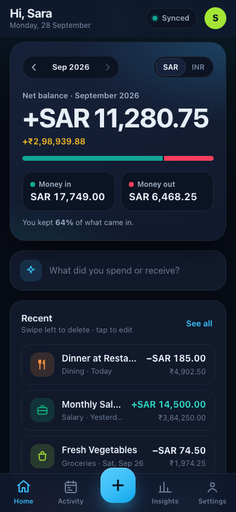
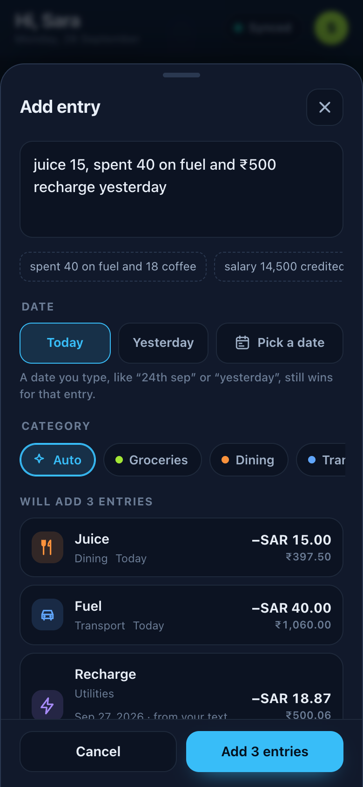
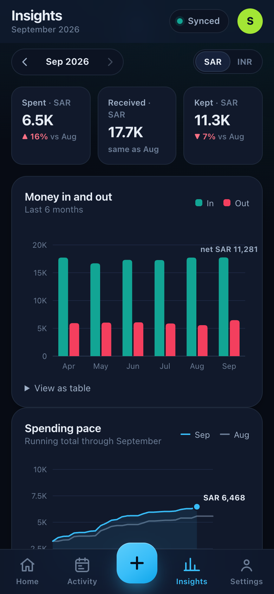
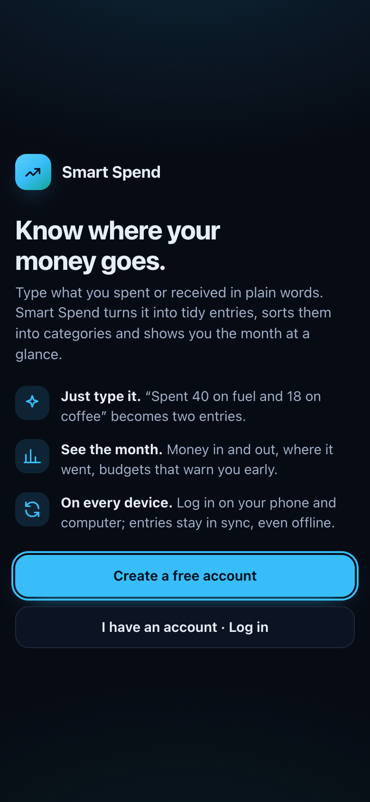
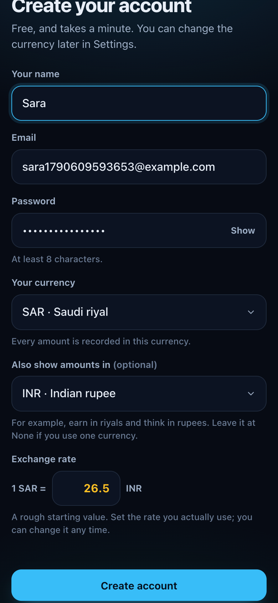
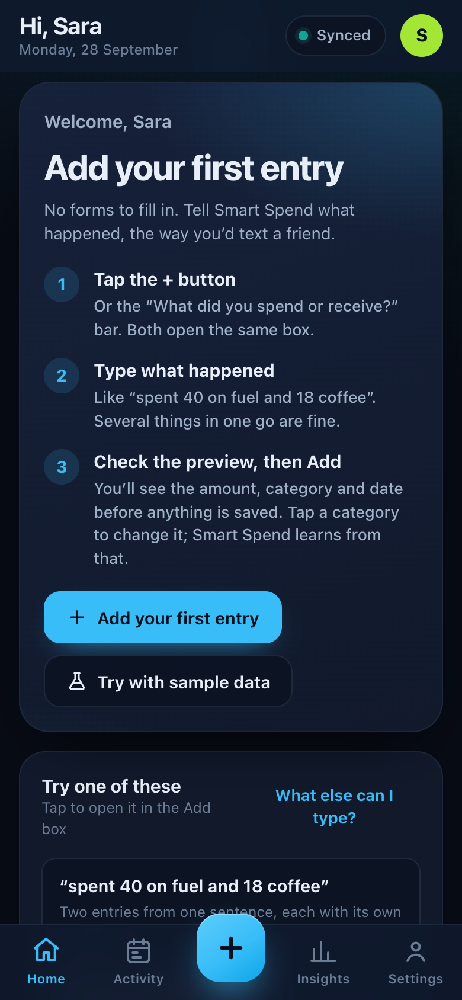
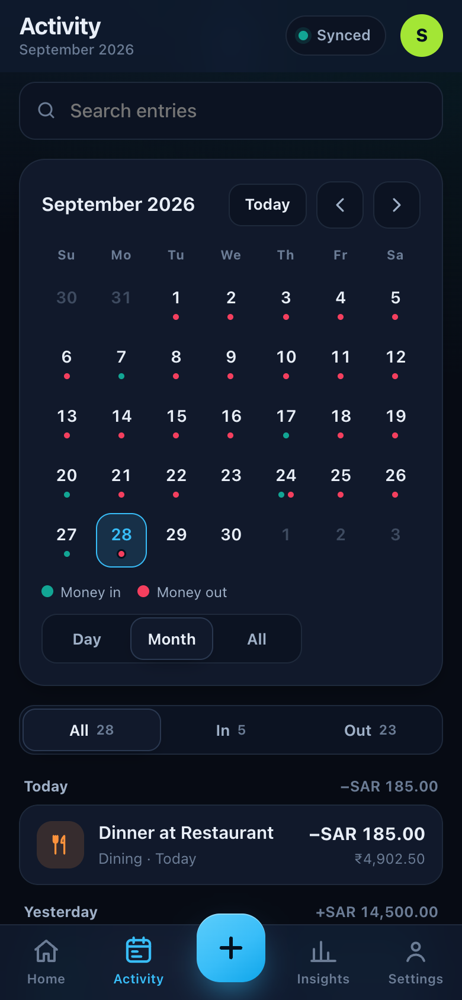

<h1 align="center">💸 Smart Spend</h1>

<b>Know where your money goes. Just type it.</b>

  <a href="https://khajamohiddinsyed.github.io/smart-spend-app/"><b>👉 Open Smart Spend</b></a> · free · works on Android, iPhone and any computer

  
  &nbsp;
  
  &nbsp;
  

Smart Spend is a money tracker you talk to in plain words. No forms, no dropdowns: write what happened the way you'd text a friend, and it becomes tidy entries with the right amount, category and date.

## ✨ How it works

1. 👤 **Create a free account.** Pick your currency, plus a second one to see amounts in if you like (earn in riyals, think in rupees).
2. 💬 **Tell it what happened.** Tap **+** and type. Several things in one message are fine.
3. 👀 **Check the preview.** Before anything is saved you see every entry: item, amount, money in or out, category and date. Tap a category to change it.
4. ✅ **Add.** It's saved on your phone instantly and synced to your account, so it's there on every device you log in on.

  
  &nbsp;
  
  &nbsp;
  

## 🧠 It understands how people actually write

- 🧃 `juice 15` → **Juice** · 15. The number goes into the amount; the name stays clean.
- ⛽ `spent 40 on fuel and 18 coffee yesterday` → **Fuel** 40 ☕ **Coffee** 18, both dated yesterday
- 💼 `salary 14,500 credited` → money **in** 💚, filed under Salary
- 📅 `on 24th sep: taxi 30, lunch 45` → both on 24 September
- 🛒 `3 coffee x 12` · `2 coffees @ 15` · `3 shirts 40 each` → worked out for you: 36 · 30 · 120
- 🔢 `rent 2.5k` · `petrol 2 lakh` · `fifty for parking` → 2,500 · 200,000 · 50
- 🌍 `groceries ٤٥٠` → Arabic and Persian digits work
- 💱 `₹500 recharge` on a riyal account → converted to riyals at **your** rate

### 🏦 Paste your bank and card messages

Copy one or several bank or credit-card SMS and paste them into the Add box. On Android you can also long-press the SMS → **Share** → **Smart Spend**.

- 📩 `Your A/c XX5348 debited by Rs. 120.00 on 20/09/26; NOORJAHAN credited…` → **Paid to Noorjahan** −120 · 🏦 IDFC FIRST A/c 5348 · 20 Sep
- 💳 `INR 431.09 spent on your … Credit Card ending XX9648 at TRAVEL FOOD SERVICES…` → **Travel Food Services** −431.09 · Dining · 💳 IDFC FIRST Card 9648
- ↩️ `Rs. 2 refunded by PAX INNOVATION… HDFC Bank Credit Card 8432` → **Refund from Pax Innovation** +2

Every entry remembers the account or card it came from. Balances, limits and reference numbers are ignored, and a message you've already added is skipped, so pasting the same SMS twice never counts it twice. Insights shows spending **by account**, and how much went on credit cards, which is borrowed money you'll pay back.

**Also:**
- 🗓️ **Dates in plain words:** today, yesterday, last friday, 3 days ago, last week, 24th sep, 24/09.
- ↕️ **In or out, worked out for you:** salary, refund, cashback and received mean money in. Spent, paid and bought mean money out.
- 🏷️ **Smart categories** from hundreds of shops, brands and everyday words (Uber, Netflix, Carrefour, Swiggy, pharmacy, rent…). Even "resturant" matches.
- 🎓 **It learns:** change a category once, and similar entries get it next time.
- 💰 **27 currencies,** with their symbols and words (₹, rs, $, €, dirham, riyals…). On a PKR account, "rs" means Pakistani rupees.

## 📊 Your month at a glance

  

- 🏠 **Home:** the month's balance, money in vs out, and how much of what came in you kept.
- 📈 **Insights:** six months of money in and out, your spending pace against last month, and where it went by category.
- 🎯 **Budgets:** a monthly limit per category, with a warning at 80% and when you go over.
- 🗓️ **Activity:** a calendar with a dot on every day with entries, plus search and In/Out filters.
- 🌓 **Dark and light themes.**

## ☁️ Every device, even offline

- ✈️ **Offline first:** entries save on the device the moment you add them and sync when you're back online. Nothing gets lost on a flight.
- 📱💻 **Same entries everywhere:** log in on your phone and your laptop. If one entry changed in two places, the latest edit wins.
- 🏠 **Add it to your home screen:** it opens full screen from its own icon, like any app.
  - **Android:** Chrome ⋮ menu → *Add to Home screen* → **Install** (not *Create shortcut*)
  - **iPhone:** Safari Share → *Add to Home Screen*

## 🔒 Your account stays yours

- 🔑 **Your password never leaves your device.** It's scrambled in the browser first, so the server never sees it.
- 🧾 **Recovery code:** shown once when you sign up. It's the only way to reset a forgotten password, so keep it safe. You can make a new one in Settings.
- 🚪 **Changing your password** signs you out of your other devices.
- 💾 **Your data, your call:** save a backup file any time, restore from one, or delete your account and every entry for good.

---

🛠️ Under the hood: plain JavaScript with no framework, served by GitHub Pages. Accounts and sync run on a Cloudflare Worker with a D1 database; see <a href="docs/API.md">docs/API.md</a>.
